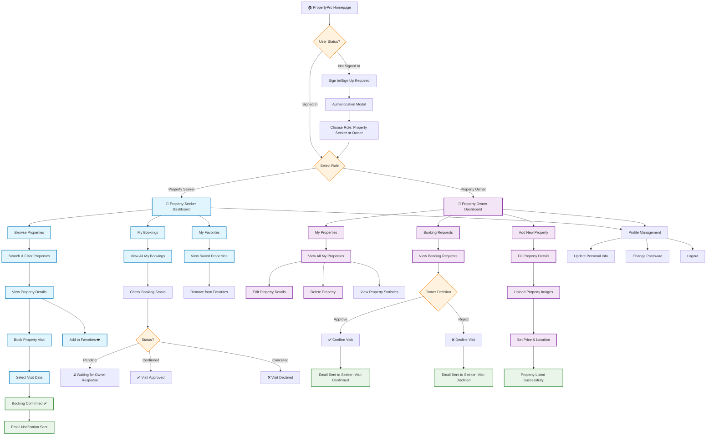
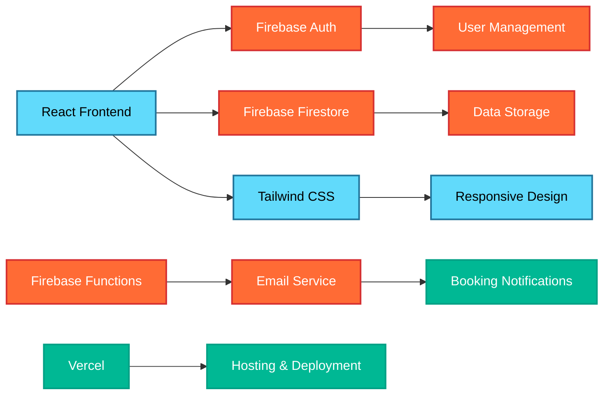

# 🏠 PropertyPro - Project Overview

## Complete User Journey & Features Diagram

## 🎯 Key Features Summary

### 👤 **Property Seeker (User) Can:**
- **Browse Properties**: Search and filter through available properties
- **View Details**: See property photos, price, location, amenities
- **Book Visits**: Schedule property viewing appointments
- **Manage Favorites**: Save interesting properties for later
- **Track Bookings**: Monitor visit request status (Pending/Confirmed/Cancelled)
- **Receive Notifications**: Get email updates on booking status

### 🏢 **Property Owner Can:**
- **List Properties**: Add new properties with photos and details
- **Manage Listings**: Edit or remove existing properties
- **Handle Bookings**: Approve or decline visit requests
- **View Statistics**: See property performance and booking data
- **Communicate**: Send automated responses to seekers
- **Prevent Self-Booking**: Cannot book visits to own properties

### 🔐 **Authentication & Security:**
- **Role-Based Access**: Different dashboards for Seekers vs Owners
- **Protected Routes**: Must sign in to access features
- **Secure Data**: Firebase authentication and database
- **Email Verification**: Automated email notifications

### 📱 **User Experience:**
- **Responsive Design**: Works on desktop, tablet, and mobile
- **Modern UI**: Clean, professional interface
- **Real-time Updates**: Instant booking status changes
- **Error Handling**: Graceful error messages and loading states
- **Guided Flow**: Clear sign-in prompts for unauthenticated users

## 🚀 **Technology Stack**

## 📊 **Project Statistics**

- **🏠 Property Types**: Residential & Commercial
- **📍 Coverage**: Pan-India (not limited to Mumbai)
- **👥 User Roles**: 2 (Property Seekers & Owners)
- **📧 Email System**: Automated notifications
- **📱 Responsive**: Mobile-first design
- **🔒 Security**: Firebase authentication
- **⚡ Performance**: Fast loading with optimized code

## 🎬 **Demo Flow for Professor**

1. **Homepage**: Show clean, professional landing page
2. **Sign-in Prompt**: Click buttons without login → Beautiful prompts
3. **Authentication**: Quick sign-up process
4. **Role Selection**: Choose Seeker or Owner
5. **Dashboard**: Role-specific interface
6. **Property Management**: Add/browse properties
7. **Booking System**: Complete visit booking flow
8. **Email Notifications**: Show automated communication
9. **Responsive Design**: Test on different screen sizes

## 💡 **Business Value**

- **For Property Seekers**: Easy property discovery and visit booking
- **For Property Owners**: Streamlined property management and lead handling
- **For Business**: Scalable platform connecting buyers and sellers
- **For Users**: Professional, trustworthy real estate experience

---

*This diagram shows the complete user journey and feature set of PropertyPro - your comprehensive real estate platform! 🏠✨*
