# 🏠 PropertyPro - Simple Project Explanation

## What is PropertyPro?
PropertyPro is like **"Airbnb for Real Estate"** - a platform where people can find properties and book visits to see them in person.

## 👥 Two Types of Users

### 1. 🔍 **Property Seekers** (People looking for homes)
**What they can do:**
- Browse through hundreds of properties
- Search by location, price, type
- View photos and details of properties
- Book appointments to visit properties
- Save favorite properties
- Track their visit requests

**Their Journey:**
```
Sign Up → Browse Properties → Find Interesting Property → Book Visit → Get Confirmation → Visit Property
```

### 2. 🏢 **Property Owners** (People selling/renting properties)
**What they can do:**
- List their properties with photos and details
- Manage all their property listings
- Receive visit requests from interested buyers
- Approve or decline visit requests
- Get notifications when someone wants to visit
- View statistics about their properties

**Their Journey:**
```
Sign Up → Add Property Details → Upload Photos → Receive Visit Requests → Approve/Decline → Meet Visitors
```

## 🔄 How It Works (Simple Flow)

```mermaid
sequenceDiagram
    participant S as 🔍 Property Seeker
    participant P as 🏠 PropertyPro Platform
    participant O as 🏢 Property Owner
    participant E as 📧 Email System

    S->>P: 1. Browse properties
    S->>P: 2. Find interesting property
    S->>P: 3. Book visit for specific date
    P->>O: 4. Send visit request notification
    O->>P: 5. Approve/Decline request
    P->>E: 6. Send confirmation email
    E->>S: 7. "Your visit is confirmed!"
    S->>O: 8. Visit property on scheduled date
```



## 🎯 Key Features (What Makes It Special)

### ✨ **For Property Seekers:**
- **No More Calling**: Book visits online, no phone calls needed
- **Save Time**: See all property details before visiting
- **Track Everything**: Know status of all your visit requests
- **Favorites**: Save properties you like for later

### ✨ **For Property Owners:**
- **Easy Management**: All properties in one dashboard
- **Qualified Leads**: Only serious buyers who book visits
- **Automated Emails**: System handles all communication
- **Statistics**: See how many people are interested

### ✨ **For Everyone:**
- **Mobile Friendly**: Works perfectly on phones and computers
- **Secure**: Safe login and data protection
- **Fast**: Quick loading and smooth experience
- **Professional**: Looks and feels like a real business platform

## 📱 What It Looks Like

### Homepage
- Beautiful design with property photos
- "Find Your Dream Property" messaging
- Sign-in prompts for accessing features

### Property Seeker Dashboard
- **Browse Tab**: Search and filter properties
- **My Bookings Tab**: Track all visit requests
- **Favorites Tab**: Saved properties

### Property Owner Dashboard
- **My Properties**: List of all their properties
- **Booking Requests**: Pending visit requests to approve
- **Add Property**: Form to list new properties

## 🚀 Why This Project is Impressive

### **Technical Excellence:**
- Built with modern web technologies
- Real-time updates and notifications
- Secure user authentication
- Responsive design for all devices

### **Business Value:**
- Solves real problem in real estate industry
- Saves time for both buyers and sellers
- Professional, scalable platform
- Ready for real-world use

### **User Experience:**
- Intuitive, easy to use
- No confusing interfaces
- Clear call-to-actions
- Helpful error messages and guidance

## 🎬 Demo Highlights

When showing to professor:
1. **Show the problem**: "Finding properties is hard, booking visits is complicated"
2. **Show the solution**: "PropertyPro makes it simple and professional"
3. **Demo user flows**: Seeker booking visit, Owner managing requests
4. **Highlight features**: Email notifications, role-based access, responsive design
5. **Show code quality**: Clean, professional, production-ready

## 💡 Real-World Impact

**Before PropertyPro:**
- Seekers: Call multiple agents, unclear property details, hard to track visits
- Owners: Miss calls, unqualified visitors, manual scheduling

**After PropertyPro:**
- Seekers: Browse online, book instantly, track everything
- Owners: Qualified leads, automated system, better management

---

**In Simple Terms**: PropertyPro is a professional real estate platform that makes finding and visiting properties as easy as booking a restaurant table online! 🏠✨
